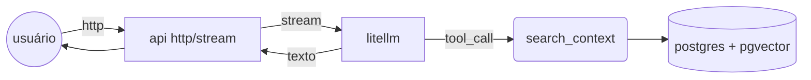

# darwin-bot – case genai (grupo boticário)

assistente virtual implementado em python que usa **retrieval‑augmented generation (rag)** para responder, em português, perguntas baseadas *exclusivamente* no livro **“a origem das espécies” (charles darwin, 1859)**.

---

## 1. arquitetura (visão geral)



* **fastapi** – serviço http + streaming.
* **litellm** – wrapper de modelos (gemini‑flash) com suporte a function‑calling.
* **rag\_tool** – implementa `search_context`, consultando vetores no pgvector.
* **pgvector** – armazena embeddings (sent‑transformers/all‑MiniLM‑L6‑v2).

---

## 2. requisitos

| categoria        | versão/testado                                                            |
| ---------------- | ------------------------------------------------------------------------- |
| python           | 3.11                                                                      |
| docker / compose | 24.x                                                                      |
| libs principais  | fastapi, uvicorn, litellm, sentence‑transformers, pgvector, psycopg, rich |

---

## 3. instalação rápida

```bash
# clone
$ git clone <repo> && cd <repo>

# levante tudo
$ docker compose up -d --build

# ingestão automática do livro ocorre no startup (db vazio)
```

### 3.1. Chave de API/Seleção de modelo

A seleção do modelo é feito no .env na variável `MODEL`.
A chave de API é feita no .env na variável `API_KEY`.
Para os tipos de modelos, pode ser encontrado em: [https://docs.litellm.ai/docs/providers/](https://docs.litellm.ai/docs/providers/). O padrão segue o seguinte:
> nome_do_provider/modelo
* eg: `openai/gpt-4o`, `gemini/gemini-flash-1.5`, `deepseek/deepseek-chat`

---

## 4. uso

### endpoint principal

```
POST /chat/completion
{
  "chat_id": "123",
  "prompt": "explique seleção natural"
}
```

* resposta é **stream** (text/plain) – cada chunk chega em tempo real.

### histórico

ao vivo:

```
GET /chat/{chat_id}/history
```

### cli opcional (`rich`)

```bash
$ uv pip install --group dev .
$ uv run chat_tui.py  # interface TUI
```

---

## 5. estratégia rag

1. **janela de memória** – últimas 5 mensagens mantidas em ram (sqlite opcional).
2. **function‑calling** – modelo decide quando disparar `search_context`.
3. **retrieval** – top‑k (k=3) via `embedding <#> query::vector` (cosine) em pgvector.
4. **síntese** – modelo gera resposta concisa, pt‑BR, citando apenas info dos trechos.

---

## 6. evoluções possíveis

* substituir MiniLM → `bge‑small‑pt` para embeddings em português.
* cache permanente de sessões em redis.
* avaliação automática de precisão (llm‑judge) + feedback loop.
* salvamento de memória em db com administração de permissões, etc.

---

## 7. execução local sem docker (opcional)

```bash
uv venv
uv sync
psql -U postgres -c "create database rag;"
uv run uvicorn src.api:app --reload --port 8000
```

---

## 8. autor

**Adriano César de Melo Camargo** 
– contato: [adrianocesar321@gmail.com](mailto:adrianocesar321@gmail.com)